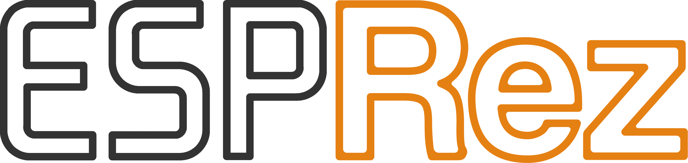

 - Rekreacja REZ Trance Vibrator oparta o ESP32 Serii S 
 - REZ Trance Vibrator Recreation based on ESP32 S-Series
|  | |
|---|---|
| Playstation 2 najlepiej sprzedająca się konsola w historii z tysiącami gier. Wiele z tytułów wydanych na tę konsolę oferowało obsługę akcesoriów lub wymagało ich posiadania do gry (mikrofony singstar, kamera Eye-Toy czy Buzzery do gry Buzz) Były też akcesoria bardziej nietypowe jak chociażby kontroler od Gametrak do gry w Golfa, kontroler w kształcie piły do Resident Evil 4 czy w kształcie katany do Onimushy 3. O wielu akcesoriach nie wiedzieć czemu słuch zaginął. Pośród tej różnorodności pomysłów wyróżnia się jednak jeden pomysł. Wibrator. Na PS2 poraz pierwszy w historii (prawdopodobnie) gra dostała jako akcesorium sex zabawkę. I jeżeli myślicie że tłumaczenia SEGI i UGA które zaczęły tłumaczyć że urządzenie należy sobie kłaść pod nogi albo do kieszeni nie są tanimi wymówkami mającymi na celu paniczne gaszenie medialnego pożaru to niestety jesteście w błędzie. Rez bowiem aluzje seksualne miał zawarte już w samym tytule. Autorzy zapisali go bowiem w kanji jako レズ (rezu) co jest slangowym określeniem pochodzącym od słowa レズビアン (rezubian) czyli słowa lesbijka. Jeżeli jednak nie ufacie mi gdyż przyznaje się otwarcie nie znam żadnego japońskiego znaczka to zaufajcie wujkowi google, wpiszcie sobie w przeglądarkę frazę レズ JAV, ale polecam nie robić tego w pracy i wykorzystać tryb incognito. Wtedy też staje się jasne dlaczego akcesorium u szczytu ma delikatne wgłębienie oraz dlaczego twórcy nazwali je "Vibrator", a nie "Massager" | Playstation 2 best-selling console ever with thousands of games. Many of the titles released for this console offered support for accessories or required them to play (singstar microphones, Eye-Toy camera or Buzzers for the game Buzz) There were also accessories that were more unusual such as a controller from Gametrak for Golf, a saw-shaped controller for Resident Evil 4 or a katana-shaped controller for Onimusha 3. No one knows why hearing about many of the accessories has disappeared. Among this variety of ideas, however, one idea stands out. The vibrator. On the PS2 for the first time ever (probably) a game got a sex toy as an accessory. And if you think that the translations of SEGA and UGA, which began to explain that the device should be placed under your feet or in your pocket, are not cheap excuses aimed at panic to extinguish the media fire, then you are sadly mistaken. For Rez had sexual allusions already contained in its very title. This is because the authors wrote it in kanji as レズ (rezu) which is a slang term derived from the word レズビアン (rezubian) meaning lesbian. However, if you don't trust me because I openly admit I don't know any Japanese stamps then trust Uncle google, type the phrase レズ JAV into your browser, but I recommend you don't do it at work and use incognito mode. Then it also becomes clear why the accessory at the top has a slight indentation, and why the makers called it “Vibrator”, not “Massager” |

 - Oryginalne urządzenie 
 - Original device

|  |  |
|---|---|
| Kontynuując jednak. Przejdźmy do czegoś co bardziej obchodzi tu obecnych niż historia, czyli założenia. Powiedzmy sobie jasno. Oryginalne akcesorium jest drogie. Sprawne urządzenie to koszt ok. 150-200 zł (40-50$) Moim założeniem podczas tworzenia projektu było zbicie tej kwoty do maksymalnie 40 zł (ok. 10$). Należy też wspomnieć że w 2006 roku powstał już projekt odtwarzający urządzenie i został zakończony, a samo urządzenie w 2 wersjach było sprzedawane. Osoby zaintersowane zapraszam do zapoznania się z projektem <a href="https://tim.cexx.org/projects/vibe/">The Drmn' Trance Vibe</a> Na swoje czasy był to bardzo dobry projekt i sami korzystaliśmy z programu testowego. Autor zawarł też masę informacji na temat parametrów zgłoszeniowych urządzenia dzięki czemu nie musieliśmy zdobywać informacji z oryginalnego urządzenia. Jednak projekt jest już bardzo archaiczny program dla mikrokontrolera pisany był w asemblerze, oprogramowanie testowe korzsysta z przestarzałych sterowików które trudno zmusić jest do działania na współczesnych systemach operacyjnych |  |
