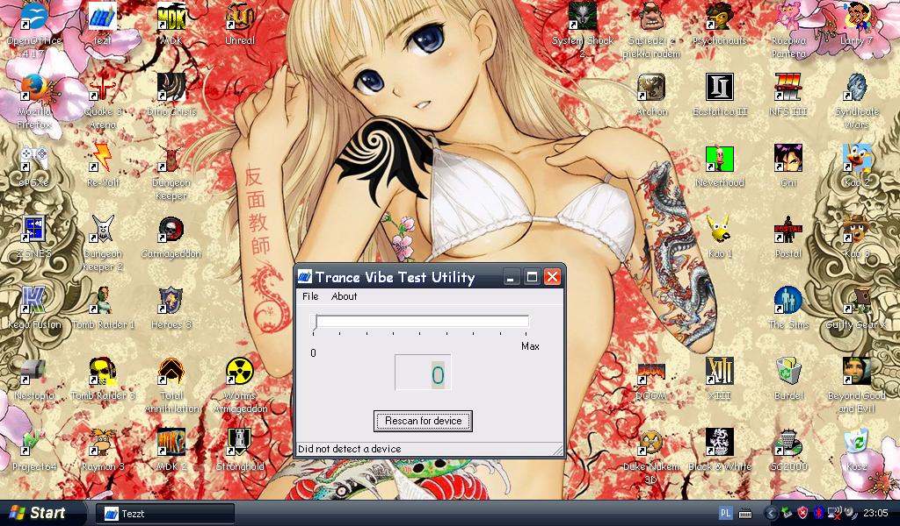
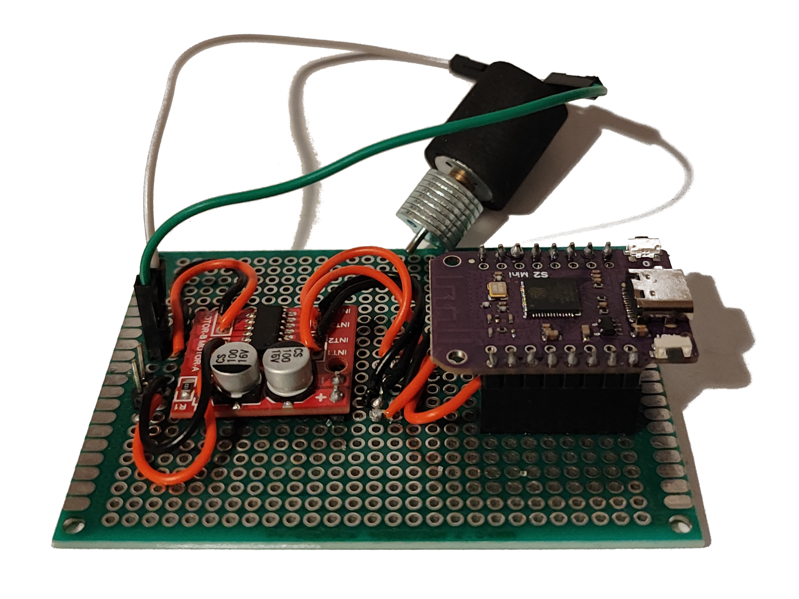
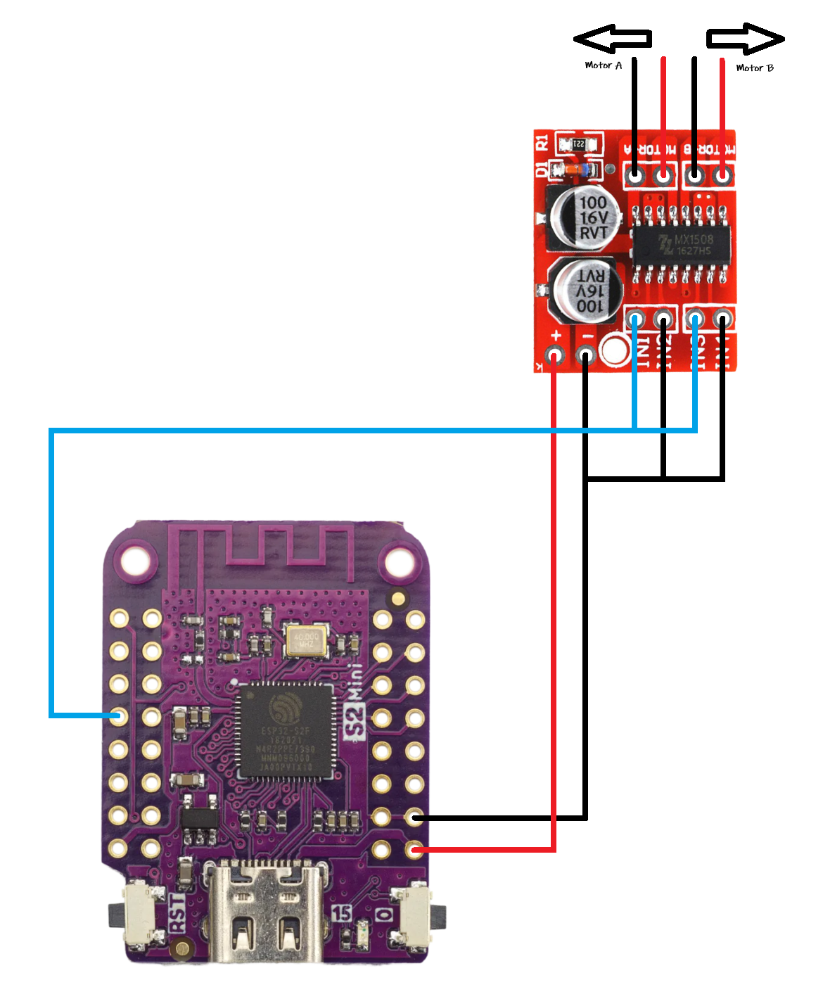

 - Rekreacja REZ Trance Vibrator oparta o ESP32 Serii S 
 - REZ Trance Vibrator Recreation based on ESP32 S-Series

|   Historia |   History|
|---|---|
| Playstation 2 najlepiej sprzedająca się konsola w historii z tysiącami gier. Wiele z tytułów wydanych na tę konsolę oferowało obsługę akcesoriów lub wymagało ich posiadania do gry (mikrofony singstar, kamera Eye-Toy czy Buzzery do gry Buzz) Były też akcesoria bardziej nietypowe jak chociażby kontroler od Gametrak do gry w Golfa, kontroler w kształcie piły do Resident Evil 4 czy w kształcie katany do Onimushy 3. O wielu akcesoriach nie wiedzieć czemu słuch zaginął. Pośród tej różnorodności pomysłów wyróżnia się jednak jeden pomysł. Wibrator. Na PS2 poraz pierwszy w historii (prawdopodobnie) gra dostała jako akcesorium sex zabawkę. I jeżeli myślicie że tłumaczenia SEGI i UGA które zaczęły tłumaczyć że urządzenie należy sobie kłaść pod nogi albo do kieszeni nie są tanimi wymówkami mającymi na celu paniczne gaszenie medialnego pożaru to niestety jesteście w błędzie. Rez bowiem aluzje seksualne miał zawarte już w samym tytule. Autorzy zapisali go bowiem w kanji jako レズ (rezu) co jest slangowym określeniem pochodzącym od słowa レズビアン (rezubian) czyli słowa lesbijka. Jeżeli jednak nie ufacie mi gdyż przyznaje się otwarcie nie znam żadnego japońskiego znaczka to zaufajcie wujkowi google, wpiszcie sobie w przeglądarkę frazę レズ JAV, ale polecam nie robić tego w pracy i wykorzystać tryb incognito. Wtedy też staje się jasne dlaczego akcesorium u szczytu ma delikatne wgłębienie oraz dlaczego twórcy nazwali je "Vibrator", a nie "Massager" | Playstation 2 best-selling console ever with thousands of games. Many of the titles released for this console offered support for accessories or required them to play (singstar microphones, Eye-Toy camera or Buzzers for the game Buzz) There were also accessories that were more unusual such as a controller from Gametrak for Golf, a saw-shaped controller for Resident Evil 4 or a katana-shaped controller for Onimusha 3. No one knows why hearing about many of the accessories has disappeared. Among this variety of ideas, however, one idea stands out. The vibrator. On the PS2 for the first time ever (probably) a game got a sex toy as an accessory. And if you think that the translations of SEGA and UGA, which began to explain that the device should be placed under your feet or in your pocket, are not cheap excuses aimed at panic to extinguish the media fire, then you are sadly mistaken. For Rez had sexual allusions already contained in its very title. This is because the authors wrote it in kanji as レズ (rezu) which is a slang term derived from the word レズビアン (rezubian) meaning lesbian. However, if you don't trust me because I openly admit I don't know any Japanese stamps then trust Uncle google, type the phrase レズ JAV into your browser, but I recommend you don't do it at work and use incognito mode. Then it also becomes clear why the accessory at the top has a slight indentation, and why the makers called it “Vibrator”, not “Massager” |

 - Oryginalne urządzenie 
 - Original device

| Założenia | Presumptions |
|---|---|
| Kontynuując jednak. Przejdźmy do czegoś co bardziej obchodzi tu obecnych niż historia, czyli założenia. Powiedzmy sobie jasno. Oryginalne akcesorium jest drogie. Sprawne urządzenie to koszt ok. 40-50$ Moim założeniem podczas tworzenia projektu było zbicie tej kwoty do maksymalnie 10$. Należy też wspomnieć że w 2006 roku powstał już projekt odtwarzający urządzenie i został zakończony, a samo urządzenie w 2 wersjach było sprzedawane. Osoby zaintersowane zapraszam do zapoznania się z projektem <a href="https://tim.cexx.org/projects/vibe/">The Drmn' Trance Vibe</a> Na swoje czasy był to bardzo dobry projekt i sami korzystaliśmy z programu testowego. Autor zawarł też masę informacji na temat parametrów zgłoszeniowych urządzenia dzięki czemu nie musieliśmy zdobywać informacji z oryginalnego urządzenia. Jednak projekt jest już bardzo archaiczny program dla mikrokontrolera pisany był w asemblerze, oprogramowanie testowe korzsysta z przestarzałych sterowików które trudno zmusić jest do działania na współczesnych systemach operacyjnych. O ile więc sporo informacji tam udostępnionych wykorzystaliśmy to sam projekt od strony zarówno software'owej jak i hardware'owej z poprzednikiem wiele wspólnego nie ma ponieważ jego odtworzenie zgodnie z tamtą dokumentacją kosztowałoby ok. 100$ co zupełnie mija się z założeniami. Dodadkowo <a href="https://github.com/kamiladas">Kadas</a> zajmujący się stroną programistyczną projektu zdecydował o przepisaniu programu tesowego jako skrypt python aby móc testować urządzenie na sprzętach współczesnych nie musząc użerać się z maszyną wirtualną. | Continuing, however. Let's move on to something that is of more concern to those present here than the story, namely the premise. Let's be clear.The original accessory is expensive. A working device costs approx. 40-50$. My assumption during the creation of the project was to bring this amount down to a maximum of $10. It should also be mentioned that in 2006 there was already a project reproducing the device and it was completed, and the device itself in 2 versions was sold. For those interested, I invite you to read <a href="https://tim.cexx.org/projects/vibe/">The Drmn' Trance Vibe project</a>. For its time it was a very good project and we used the test program ourselves. The author also included a ton of information about the device's notification parameters so we didn't have to get the information from the original device. However, the project is already very archaic, the program for the microcontroller was written in assembler, the test software korzsysta from outdated drivers that are difficult to force to work on modern operating systems. While we used a lot of the information provided there, the project itself, from both the software and hardware sides, has little in common with its predecessor, because its reproduction according to that documentation would cost about $100, which is completely out of line. In addition, <a href="https://github.com/kamiladas">Kadas</a>, who is responsible for the programming side of the project, decided to rewrite the Test program as a python script in order to be able to test the device on modern hardware without having to use a virtual machine. |

 - Program testowy uruchomiony na HP 2133 Mini 
 - Test program running on an HP 2133 Mini

 - Skrypt testowy napisany przez <a href="https://github.com/kamiladas">Kadasa</a> uruchomiony na współczesnym komputerze 
 - Test script written by <a href="https://github.com/kamiladas">Kadas</a> running on a modern computer

| Sprzęt | Hardware |
|---|---|
| Urządzenie bazuje na mikrokontrolerze ESP32-S2 ponieważ dostępny jest na chińskich portalach aukcyjnych za ok. 2-3$. Dlaczego do projektu w którym wystarczyłaby moc obliczeniowa ATTiny wykorzystuje tak "Potężny" mikrokontroler? Odpowiedź jest prosta. Ponieważ urządzeniu należy podmienić PID i VID. Czym one są opisane zostanie w cześci omawiającej program. Co ważne to fakt że na podmianę tych wartości pozwalają tylko mikrokontrolery ESP32 serii S. Jako że DevKit S2 jest najtańszy, to go postanowiłem wybrać jako serce projektu. Kolejna sprawa to zasilanie silnika. Prądy podawane przez mikrokontroler są bowiem zbyt małe aby podłączyć silnik bezpośrednio, poza tym sygnały podawane na wyjściu mikrokontrolera to nie napięcie stałe, a sygnał <a href="https://pl.wikipedia.org/wiki/Modulacja_szeroko%C5%9Bci_impuls%C3%B3w">PWM</a>. Dlatego aby nie kombinować z tanzystorami, mostkami H, MOSFETami i innymi czarnymi magiami. Po prostu jak każdy szanujący się elektronik amator, użyje Sterownika PWM przeznaczonego do silników. W projekcie zastosowałem chiński MX1508, ale każdy inny sterownik pracujący na napięciu 5V się nada (np. DRV8833 czy L9110s). Do tego użyje silniczka wibracyjnego. Tu również pełna dowolność, możecie go wyciągnąć z jakiegoś starego urządzenia, zabawki z sex shopu lub też kupić. Zwróćcie tylko uwagę aby był to silnik którego nie zabije napięcie 5V. Sterownik to koszt 1-3$ natomiast silniczek 0-2$. W ten sposób za 4-8$ możecie mieć akcesorium do PS2. | The device is based on ESP32-S2 microcontroller because it is available on Chinese auction sites for about $2-3. Why for a project in which the computing power of ATTiny would be enough uses such a “Powerful” microcontroller? The answer is simple. Because the device needs to be swapped PID and VID. What they are will be described in the part discussing the program. What is important is the fact that only ESP32 S-series microcontrollers allow you to swap these values.As DevKit S2 is the cheapest, I decided to choose it as the heart of the project. Another issue is the power supply to the motor. This is because the currents given by the microcontroller are too small to connect the motor directly, besides, the signals given at the output of the microcontroller are not DC voltage, but a <a href="https://en.wikipedia.org/wiki/Pulse-width_modulation">PWM</a> signal. Therefore, in order not to combine with tanistors, H-bridges, MOSFETs and other black magic. Simply, like any self-respecting amateur electronics engineer, will use a PWM Controller designed for motors. In the project I used a Chinese MX1508, but any other driver operating at 5V will do (such as DRV8833 or L9110s). For this I will use a vibration motor. Here, too, full freedom, you can pull it out of some old device, toy from a sex shop or also buy it. Just make sure that it is a motor which will not be killed by 5V. The controller costs $1-3, while the motor costs $0-2. Thus, for $4-8 you can have an accessory for the PS2. |

 - Mało reprezentacyjny prototyp urządzenia (ale działa) 
 - Hardly a representative prototype of the device (but it works)

 - Schemat połączeniowy prototypu 
 - Wiring diagram of the prototype
