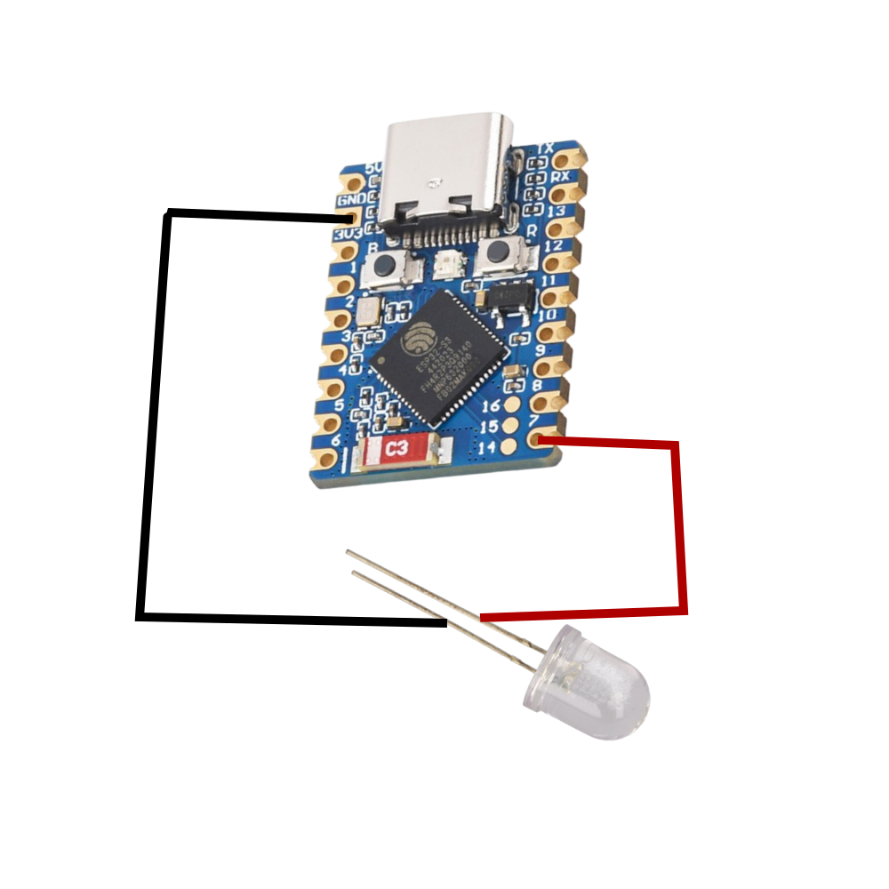
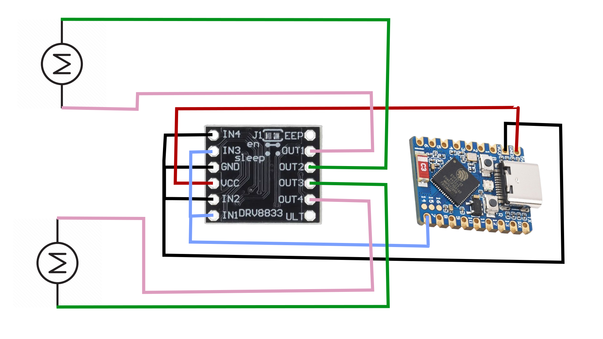
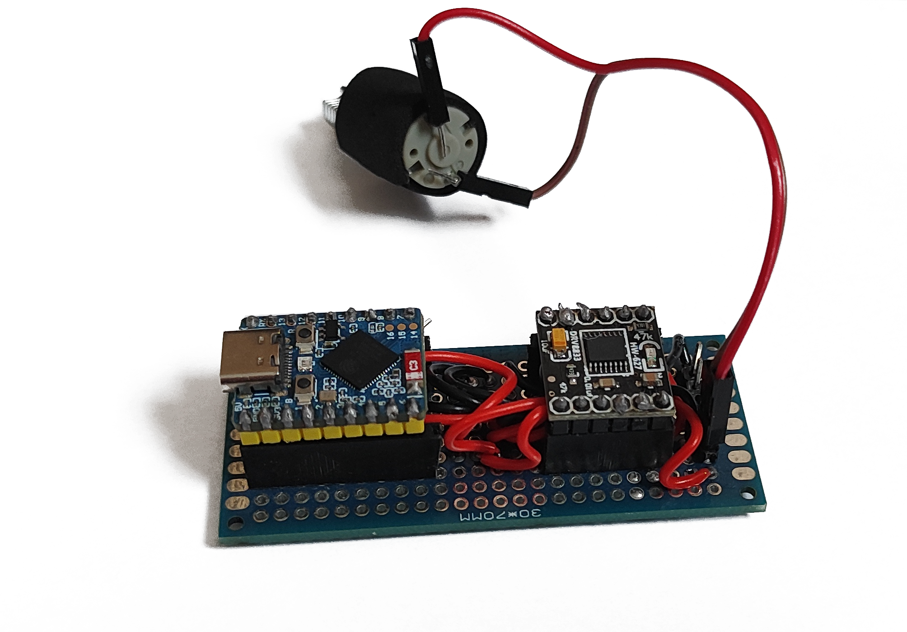

# Readme under construction

 - Rekreacja REZ Trance Vibrator oparta o ESP32 Serii S<br>
 - REZ Trance Vibrator Recreation based on ESP32 S-Series

[](https://www.youtube.com/watch?v=rmJZSiyocIU)<br>
 - ESPREZ w akcji (do celów prezentacyjnych, silnik zastąpiony diodą LED)<br>
 - ESPREZ in action (for presentation purposes, motor replaced by LED)

---

| <br><h1>Podstawy implementacji projektu</h1> | <br><h1>Basics of project implementation</h1> |
|---|---|
| <h3>Instalacja programu na mikrokontrolerze</h3> Aby tym co chcą bez zbędnych przedłużeń móc mieć w swoim posiadaniu gotowe urządzenie, przestawiam instrukcję instalacji programu na ESP32-S3, dlaczego S3, a nie zdecydowanie tańsze S2? ponieważ ani mi ani programiście nie udało się go sflashować. Oto więc co po kolei należy zrobić:| <h3>Installation of the program on the microcontroller</h3> In order for those who want to be able to have a finished device in their possession without unnecessary extensions, I am rearranging the instructions for installing the program on the ESP32-S3, why the S3 and not the definitely cheaper S2? because neither I nor the programmer managed to sflash it. So here is what to do one by one: |
| 1. **Instalacja ESP-IDF (jeżeli posiadasz, możesz pominąć)**:<br>- Sklonuj repozytorium ESP-IDF i postępuj zgodnie z instrukcjami instalacji zawartymi w [oficjalnej dokumentacji ESP-IDF](https://docs.espressif.com/projects/esp-idf/en/latest/esp32/get-started/).<br> | 1. **install ESP-IDF (if you have one, you can skip it)**:<br>- Clone the ESP-IDF repository and follow the installation instructions provided in the [official ESP-IDF documentation](https://docs.espressif.com/projects/esp-idf/en/latest/esp32/get-started/).<br> |
```bash
    git clone https://github.com/espressif/esp-idf.git
    cd esp-idf
    ./install.sh
    . ./export.sh
```

|  |  |
|---|---|
| 2. **Sklonuj repozytorium projektu**:<br>- Sklonuj to repozytorium na twoją lokalną maszynę:<br> | 2. **Clone the Project Repository**:<br>- Clone this repository to your local machine:<br> |
  ```bash
    git clone https://github.com/retromaniak/ESPREZ
    cd ESPREZ
  ```
|  |  |
|---|---|
| 3. **Skonfiguruj urządzenie docelowe**:<br>- Ustaw urządzenie docelowe jako ESP32-S3:<br>| 3. **Configure the Target Device**:<br>- Set the target device to ESP32-S3:<br> |
```bash
    idf.py set-target esp32s3
```
|  |  |
|---|---|
| 4. **Zbuduj Projekt**:<br>- Uruchom poniższą komendę aby zbudować projekt<br> | 4. **Build the Project**:<br>- Run the following command to build the project:<br> |
```bash
    idf.py build
```
|  |  |
|---|---|
| 5. **Flashowanie Oprogramowania układowego**:<br>- Po zbudowaniu podłącz ESP32-S3 do komputera i sflashuj oprogramowanie układowe:<br> | 5. **Flash the Firmware**:<br>- After building, connect the ESP32-S3 to your machine and flash the firmware:<br> |
```bash
    idf.py flash
```
| Opcjonalnie | Optional |
|---|---|
| 6. **Monitor Wyjścia**:<br>- Aby monitorować wyjście urządzenia, należy użyć:<br> | 6. **Monitor the Output**:<br>- To monitor the device output, use:<br> |
```bash
    idf.py monitor
```

| <h3>Lista mikrokontrolerów kompatybilnych z projektem</h3> | <h3>List of microcontrollers compatible with the project</h3> |
|---|---|
| Projekt bazuje na bibliotece TinyUSB która odpowiada za zmianę PID oraz VID jak też obsługę nietypowych zapytań od konsoli. Nie każdy mikrokontroler nadaje się do tego celu. Wczytując się w dokumentację tinyUSB odnaleźć możecie [listę kompatybilności mikrokontrolerów](https://docs.tinyusb.org/en/stable/reference/supported.html) z tą biblioteką. Jeżeli w kolumnie Device znajduje się ✔ oznacza to iż wykorzystanie tego mikrokontrolera w projekcie ESPREZ jest możliwe. Jeżeli wasz mikrokontroler nie widnieje na liście, bądź jest oznaczony we wcześniej wspomnianej kolumnie ✖ oznacza to że w projekcie wykorzystany być nie może.<br>| The project is based on the TinyUSB library, which is responsible for changing the PID and VID as well as handling unusual requests from the console. Not every microcontroller is suitable for this purpose. In the tinyUSB documentation you can find a [list of microcontrollers compatible](https://docs.tinyusb.org/en/stable/reference/supported.html) with this library. If in the Device column you can find ✔, it means that the use of this microcontroller in the ESPREZ project is possible. If your microcontroller does not appear in the list, or is marked in the ✖ column mentioned above, it means that it cannot be used in the project.<br> |

<table>
  <tr>
    <th><h3>Budowa Hardware'u</h3></th>
    <th><h3>Hardware Construction</h3></th>
  </tr>
  <tr>
    <td>Najprostsze połączenie pozwalające ocenić sprawność projektu wymaga mikrokontrolera posiadającego wyprowadzenie GPIO7 (w tym przypadku ESP32-S3 Zero) oraz diody LED które połączyć należy zgodnie ze schematem zaprezentowanym na obrazku poniżej:</td>
    <td>The simplest connection to evaluate the efficiency of the project requires a microcontroller that has a GPIO7 pin (in this case ESP32-S3 Zero) and LEDs, which should be connected according to the schematic presented in the image below:</td>
  </tr>
  <tr>
    <td colspan="2"><br>
     - Schemat minimalnego połączenia<br>
 - Basic connection diagram</td>
  </tr>
    <tr>
    <td>Do uzyskania pełni doświadczenia związanego z używaniem akcesorium wymagany jest jednak silnik wibracyjny. Tu też pojawia się problem. Mianowicie po pierwsze ESP wysyła na swoje wyjścia sygnał o zbyt niskim natężeniu prądu by móc uruchomić silnik wibracyjny. Po drugie sygnał który otrzymujemy na GPIO7 nie jest sygnałem analogowym, a sygnałem o zmiennym wypełnieniu impulsu (PWM). Nie wdając się w szczegóły, sygnał taki nie nadaje się do zasilania silników nawet po jego wzmocnieniu. Oczywiście można na podstawie tranzystora i kilku elementów towarzyszących zbudować na piechotę układ zamieniający sygnał PWM na analogowy i go wzmacniający do poziomu pozwalającego poprawnie zasilić silnik, jednakże ja nie mam pojęcia na temat tego zagadnienia, a pasjonaci elektroniki na forach internetowych to osoby o tak dużej empatii w stosunku do osób chcących zapoznać się z tym tematem że są ostatnimi ludźmi których chcecie poprosić o radę. Jest jednak na to rozwiązanie, a mianowicie sterownik PWM. Najpopularniejsze układy będą operowały na napięciu 12V i będą duże co uniemożliwi ich użycie w projekcie. Są jednak również układy kompaktowe, możliwe do zasilania napięciem 5V. Osobiście polecam układ DRV8833 który jest tani i działa, a płytki prototypowe z nim na pokładzie mają wyprowadzenia na raster 2,54mm więc są łatwe do użycia w projektach. Efektem ubocznym takich urządzeń jest to iż projektowane są zazwyczaj do modeli RC więc oferują nie jedno a 2 wyjścia dla silników. W efekcie zerowym kosztem otrzymujemy urządzenie obsługujące do 2 silników wibracyjnych.</td>
    <td>However, a vibration motor is required to get the full experience of using the accessory. This is also where the problem arises. Namely, firstly, the ESP sends a signal with too low a current to its outputs to run the vibration motor. Secondly, the signal you get on GPIO7 is not an analog signal, but a pulse-width variable (PWM) signal. Without going into details, such a signal is not suitable for powering motors even after amplification. Of course, it is possible to build on foot, based on a transistor and a few accompanying elements, a circuit that converts the PWM signal into an analog signal and amplifies it to a level that allows you to properly power the motor, however, I have no idea about this issue, and electronics enthusiasts on Internet forums are people with so much empathy towards people who want to learn about this topic that they are the last people you want to ask for advice. There is a solution to this, however, and that is a PWM controller. The most popular circuits will operate on 12V and will be large, making them impossible to use in a project. However, there are also compact circuits that can be powered by 5V. I personally recommend the DRV8833 chip, which is cheap and works, and prototype boards with it on board have leads on a 2.54mm raster so they are easy to use in projects. A side effect of such devices is that they are usually designed for RC models so they offer not one but 2 outputs for motors. As a result, at zero cost you get a device that supports up to 2 vibration motors.</td>
  </tr>
  <tr>
    <td colspan="2"><br>
     - Schemat połączenia rozszerzonego<br>
 - Extended connection diagram</td>
  </tr>
</table>

<br>
     - Przykładowy, działający, kompletny prototyp urządzenia<br>
 - An example of a working, complete prototype device</td>

---

| <br><h1>Założenia i problemy</h1> | <br><h1>Assumptions & problems</h1> |
|---|---|
| <h4>Założenia</h4>Rez trance vibrator to urządzenie skrajnie ciekawe. Swoisty żart grupy zapaleńców który okazał się zbyt kontrowersyjny i potem musieli się z tego tłumaczyć. Obecnie jest to akcesorium zdecydowanie interesujące historycznie. I to mówiąc śmiertelnie poważnie. Problem jest tylko jeden. Obecnie sprzęt ten jest po prostu zbyt drogi jak na to co oferuje, wszak to w końcu dosłownie silnik wibracyjny na USB. oryginalny, sprawny sprzęt to koszt ok. 40-50$, równowartość konsoli z grą do której ma to być podłączone. Pojawiło się więc założenie. Stworzyć urządzenie możliwie tanie, w oparciu o współczesne podzespoły. Najlepiej w oparciu o możliwie najpopularniejszą platformę. Sprzęt w założeniach jest banalnie prosty więc parametry mają tu marginalne znaczenie. na dobrą sprawę wystarczyła by moc jakiegoś ATTiny. Jest tylko jeden problem. Aby urządzenie działało poprawnie musi ono mieć zdefiniowane pewne parametry oczekiwane przez konsolę oraz obsługiwać zapytanie 0x40 wysyłane z konsoli. Aby więc nie robić na nowo czegoś co już istnieje, warto wykorzystać narzędzia które już ktoś stworzył. Dobra wiadomość jest taka że istnieje popularna biblioteka TinyUSB, zajmie się ona obsługą USB. Zła wiadomość zaś jest taka że biblioteka ta wspiera wyłącznie określone w liście kompatybilności urządzenia. Po wejściu na stronę poznajemy smutną prawdę. Żadne Arduiono nie będzie w stanie jej obsłużyć. Jest jednak też dobra wiadomość. Obsługiwane są mikrokontrolery ESP32 serii S czyli produkt firmy Espressif. Zyskały one popularność ok. 10 lat temu gdyż natywnie obsługują Wi-Fi i Bluetooth. Dodatkowo są sprzętami 32-bitowymi (co jednak w przypadku amatorskich projektów nie ma aż takiego znaczenia), obsługują jednak w poprównaniu do Arduino kosmiczne ilości pamięci Flash (Do 32MB) oraz Ram (Do 520kB). W przypadku tego projektu ważne jest coś innego. ESP32 serii S obsługuje bowiem natywnie USB i jest kompatybilne z TinyUSB. Co lepsze, już od dawa są one kompatybilne z Arduino IDE, również biblioteka TinyUSB dostała nieoficjalne wsparcie w tym środowisku. Koszt ESP32 u lokalnych sprzedawców nie powinien przekroczyć 7$, silnik wibracyjny to koszt max. 2$ dodatkowo wcześniej wspomniany sterownik PWM to kolejne 2$. Co przy odpowiednim doborze komponentów pozwoli nam zamknąć się w 10$, biorąc pod uwagę że jest to konstrukcja chałupnicza, to naprawdę dobry wynik. Mamy więc następujące założenia:<br>- Budżet: 5$ (wykorzystam ESP32-S2 którego koszt zakupu to 2 - 2,5$)<br>- Mikrokontroler: ESP32-S2<br>- Środowisko programistyczne: Arduino IDE<br><h4>Problemy</h4>Jak się domyślacie założenia te podczas tworzenia projektu skonfrontowane zostały z rzeczywistością i się posypały. Pozwolę sobie więc teraz opisać pokolei wszelkie napotkane podczas tworzenia projektu trudności.<br>**ESP32-S2** - Zacznijmy od mikrokontrolera. ESP32-S2 wydaje się świętym graalem. Mikrokontroler który z chin można sprowadzić za ok. 2$ oferuje dość duży zapas mocy, dużą liczbę portów oraz jest po prostu tani. Dlaczego więc jest tak rzadko używany w różnych projektach? Otóż jest jedna kwestia, czyli flashowanie oprogramowania układowego. na 3 posiadane przeze mnie mikrokontrolery tego typu, ani jednego nie udało mi się sflashować. Jeżeli ktoś potrafi to zrobić i wytłumaczyć, może założyć zagadnienie, wytłumaczyć mi tam jak flashowanie przeprowadzić. Jeżeli to się komuś uda dodam go do kontrybutorów i podziękuję w zakończeniu readme. Na razie więc musiałem zdecydować o zmianie mikrokontrolera na **ESP32-S3**. S3 nie jest złym mikrokontrolerem, jednak jego koszt to już ok 4 - 4,5$, poza tym jest to mikrokontroler 2-rdzeniowy co przy projekcie w którym potrzeba mniej więcej tyle mocy ile oferuje Arduino UNO jest po prostu przesadą i szkoda "marnowania" tak mocnego mikrokontrolera na tak prosty projekt. Przy tym nastąpiła konieczność zrewidowania kolejnego założenia czyli budżetu. Z racji że ESP32-S2 okazało się niemożliwe do wykorzystania, również niemożliwe okazało zmieszczenie się w budżecie 5$, dlatego postanowiłem i to założenie zmodyfikować i "zwiększyć" budżet do 10$.<br>**Arduino IDE** - Wspomniałem że chciałbym aby projekt był tworzony w Arduino IDE. Zależało mi na tym aby każdy amator mający choćby minimalne pojęcie na temat mikrokontrolerów mógł cieszyć się tym projektem. Okazało się jednak że niestety TinyUSB dla Arduino IDE wydają się nie wykorzystywać części możliwości biblioteki, bądź nam nie udało się dojść do sposobu na modyfikację danych mechanizmów. Dlatego musieliśmy również to wymaganie zmodyfikować i zmienić środowisko na **ESP-IDF** które oficjalnie wspiera TinyUSB więc działa ono zgodnie z dokumentacją. Utrudnia to nieco testowanie projektu przez amatorów i analizę kodu przez ludzi przezywczxajonych do Arduino IDE, ale zrobiliśmy co w naszej mocy by problemy te rozwiązać. Założenia docelowe wyglądają więc następująco:<br>- Budżet: 10$ <br>- Mikrokontroler: ESP32-S3<br>- Środowisko programistyczne: ESP-IDF | <h4>Purpose</h4>Rez trance vibrator is an extremely interesting device. A peculiar joke by a group of enthusiasts that turned out to be too controversial and they later had to explain themselves. Today it is an accessory of definite historical interest. And that's taking it deadly seriously. There is only one problem. Currently, this equipment is simply too expensive for what it offers, after all, it is literally a vibration motor on a USB. The original, working hardware costs approx. 40-50$, the equivalent of the console with the game to which it is to be connected. So the premise emerged. To create a device as cheap as possible, based on modern components. Preferably based on the most popular platform possible. The hardware in the assumptions is trivially simple so the parameters here are of marginal importance. for good measure, the power of some ATTiny would be enough. There is only one problem. In order for the device to work properly it must have defined certain parameters expected by the console and support 0x40 query sent from the console. So in order not to re-do something that already exists, it makes sense to use tools that someone has already created. The good news is that there is a popular library TinyUSB, it will take care of USB handling. The bad news, on the other hand, is that this library only supports the devices specified in the compatibility list. Upon entering the site, we learn the sad truth. No Arduiono will be able to support it. However, there is also good news. ESP32 S-series microcontrollers, a product of Espressif, are supported. They gained popularity about 10 years ago because they natively support Wi-Fi and Bluetooth. In addition, they are 32-bit hardware (which, however, in the case of amateur projects does not matter so much), but support cosmic amounts of Flash memory (up to 32MB) and Ram (up to 520kB) compared to Arduino. In the case of this project, something else is important. This is because the ESP32 S-series natively supports USB and is compatible with TinyUSB. What's better, they are already compatible with Arduino IDE since dawa, also the TinyUSB library got unofficial support in this environment. The cost of ESP32 at local vendors should not exceed $7, the vibration motor costs max. 2$ additionally the previously mentioned PWM controller is another 2$. Which, with the right selection of components, will allow us to close in on $10, considering that this is a cottage industry construction, a really good result. So we have the following assumptions:<br>- Budget: 5$ (I will use the ESP32-S2 whose purchase cost is $2 - $2.5)<br>- Microcontroller: ESP32-S2<br>- Development environment: Arduino IDE <h4>Problems</h4>As you can guess, these assumptions were confronted with reality during the development of the project and went awry. So let me now describe, bit by bit, all the difficulties encountered during the development of the project.<br>**ESP32-S2** - Let's start with the microcontroller. ESP32-S2 seems to be the holy grail. The microcontroller, which can be imported from China for about $2, offers quite a lot of power, a large number of ports and is simply cheap. So why is it so rarely used in various projects? Well, there is one issue, namely firmware flashing. Out of the 3 microcontrollers of this type that I own, I have not managed to sflash a single one. If someone can do it and explain it, can set up an issue, explain to me there how to do the flashing. If someone succeeds I will add it to the contributors and thank you in the end of the readme. So for now I had to decide to change the microcontroller to **ESP32-S3**. The S3 is not a bad microcontroller, but its cost is already about $4-$4.5, in addition, it is a 2-core microcontroller, which for a project that needs about as much power as the Arduino UNO offers is simply excessive, and it is a pity to “waste” such a powerful microcontroller for such a simple project. With this came the need to revise another assumption, namely the budget. Since ESP32-S2 turned out to be impossible to use, it also turned out to be impossible to fit into the $5 budget, so I decided to modify this assumption as well and “increase” the budget to $10.<br>**Arduino IDE** - I mentioned that I would like the project to be created in the Arduino IDE. I wanted any amateur with even a minimal understanding of microcontrollers to be able to enjoy this project. However, it turned out that, unfortunately, TinyUSB for Arduino IDE seems not to use some of the capabilities of the library, or we did not manage to come to a way to modify the mechanisms in question. Therefore, we also had to modify this requirement and change the environment to **ESP-IDF**, which officially supports TinyUSB so it works according to the documentation. This makes it a bit more difficult for amateurs to test the project and for people who have been converted to the Arduino IDE to analyze the code, but we have done our best to solve these problems. So the target assumptions look as follows:<br>- Budget: 10$<br>- Microcontroller: ESP32-S3<br>- Development environment: ESP-IDF |

---

### ESP32-S3 HID Device Project with Custom Setup Request Handling

This project showcases the implementation of a USB HID device on an ESP32-S3 microcontroller using TinyUSB, along with custom handling of USB Setup requests. It includes emulation of a vibration device that receives data from the host and uses it to control vibration strength.

---

### Project Overview

The main functionality of this project involves:
- **USB HID Emulation**: The ESP32-S3 acts as a HID (Human Interface Device) that communicates with a host over USB.
- **Custom Setup Request Handling**: The device can handle vendor-specific requests from the host, processing them and returning appropriate responses.
- **Vibration Control**: The device receives data from the host, processes it, and translates it into vibration strength (in percentage) for a motor.

---

### Code Overview

1. **USB Descriptors**:
    - The descriptors define the device as a HID and include necessary vendor and product IDs.
    - The HID report descriptor is defined to handle both IN and OUT data transactions with the host.
    - Strings describe the device as "ASCII Vib" with manufacturer information as "ASCII CORPORATION".

2. **HID Report Handling**:
    - The `tud_hid_set_report_cb` function receives data from the host and processes it as control commands.
    - It extracts two ASCII characters, converts them into a hexadecimal value, and then uses this value to control the vibration strength via `vibration_strange()`.
    - The `vibration_strange()` function controls the vibration motor's strength based on the received value.

3. **Custom Setup Requests**:
    - The `tud_control_request_cb` function handles vendor-specific requests (`0x41`) from the host, responding with predefined data.
    - This data is then returned to the host through a control transfer.

4. **USB Initialization**:
    - The `app_main` function initializes the TinyUSB driver and configures the ESP32-S2 as a HID device.
    - It enters an infinite loop waiting for data to be processed.

---

### Custom `usbd.c` Modification for Setup Requests

In order to process custom setup requests in the USB device, we modify the `usbd.c` file to handle specific `DCD_EVENT_SETUP_RECEIVED` events. The custom code detects vendor-specific requests (`0x40`) and processes them by converting received data to a hexadecimal string format before sending it back to the host.

#### Modified `case DCD_EVENT_SETUP_RECEIVED`:

```c
case DCD_EVENT_SETUP_RECEIVED:
    TU_LOG_PTR(USBD_DBG, &event.setup_received);
    TU_LOG(USBD_DBG, "\r\n");

    // Mark as connected after receiving the first setup packet
    _usbd_dev.connected = 1;

    // Clear busy and claimed flags for control endpoints
    _usbd_dev.ep_status[0][TUSB_DIR_OUT].busy = 0;
    _usbd_dev.ep_status[0][TUSB_DIR_OUT].claimed = 0;
    _usbd_dev.ep_status[0][TUSB_DIR_IN].busy = 0;
    _usbd_dev.ep_status[0][TUSB_DIR_IN].claimed = 0;

    // Handle vendor-specific requests (0x41 indicates vendor-specific)
    if (event.setup_received.bmRequestType == 0x41 || event.setup_received.bmRequestType == 0x40 ) {
        TU_LOG(USBD_DBG, "Vendor-specific request received\n");

        // Buffer for response data
        char buffer[128]; 

        // Convert request data to hex format (8 bytes, based on example)
        snprintf(buffer, sizeof(buffer), 
                 "%02X %02X %04X %04X %04X", 
                 event.setup_received.bmRequestType, 
                 event.setup_received.bRequest, 
                 event.setup_received.wValue, 
                 event.setup_received.wIndex, 
                 event.setup_received.wLength);

        // Log the buffer content
        TU_LOG(USBD_DBG, "Buffer content: %s", buffer);

        // Send buffer as response to the host
        tud_control_xfer(event.rhport, &event.setup_received, buffer, strlen(buffer));

        // Call `tud_hid_set_report_cb` to process data
        tud_hid_set_report_cb(0, event.setup_received.bRequest, HID_REPORT_TYPE_OUTPUT, (uint8_t*)buffer, strlen(buffer));

        break;
    }

    // Stall the endpoint if request can't be processed
    if (!process_control_request(event.rhport, &event.setup_received)) {
        dcd_edpt_stall(event.rhport, 0);
        dcd_edpt_stall(event.rhport, 0 | TUSB_DIR_IN_MASK);
    }
    break;
```

This modification processes vendor-specific setup requests by logging their details, sending a debug response back to the host, and invoking a callback for further processing. Unsupported requests are rejected by stalling the control endpoint.

---

| Podziękowania | Acknowledgements |
|---|---|
| Do stworzenia projektu świadomie, lub nieświadomie przyczynili się do tego że projekt ten istnieje. Kilka osób zasługuje jednak na szczególne podziękowania. Przede wszystkim dla [kadasa](https://github.com/kamiladas) który podjął się realizacji programistycznej części projektu. Podziękowania dla [autora poprzedniej rekreacji](https://tim.cexx.org/projects/vibe/) tego sprzętu który najpewniej nieświadomy jest obecnej jego realizacji, aczkolwiek jego oprogramowanie testowe w początkowej fazie bardzo ułatwiło testowanie sprzętu, podziękowania dla [Elektro Damixa](https://www.instagram.com/elektrodmx/) który służył wskazówkami dotyczącymi rozwiązań hardware'owych oraz dla [DKSW](https://github.com/dskw) który dzięki założonemu do projektu zagadnieniu ostatecznie przypieczętował jego zakończenie, no i kanałowi [ARHN.EU](https://ar.hn/) który stworzył materiał i uświadomił mnie że takie akcesorium wogóle istnieje. Jeszcze raz dziękuję! | They have consciously or unconsciously contributed to the creation of the project. Several people, however, deserve special thanks. First of all, to [kadas](https://github.com/kamiladas) who undertook the programming part of the project. Thanks to the [author of the previous recreation](https://tim.cexx.org/projects/vibe/) of this equipment, who is probably unaware of its current implementation, although his test software in the initial phase greatly facilitated the testing of the equipment, thanks to [Elektro Damix](https://www.instagram.com/elektrodmx/) who served with tips on hardware solutions, and to [DKSW](https://github.com/dskw) who, thanks to the issue set up for the project, finally sealed its completion, well, and the channel [ARHN.EU](https://ar.hn/) who created the material and made me aware that such an accessory even exists. Thank you again!

For more details, please visit the repository and documentation at [GitHub Repository](https://docs.tinyusb.org/en/latest/reference/index.html).
