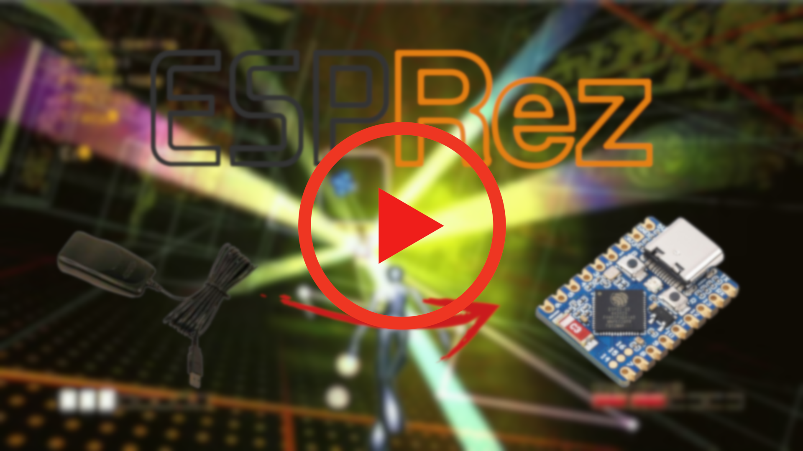

# Readme under construction

 - Rekreacja REZ Trance Vibrator oparta o ESP32 Serii S<br>
 - REZ Trance Vibrator Recreation based on ESP32 S-Series

[](https://www.youtube.com/watch?v=rmJZSiyocIU)<br>
 - ESPREZ w akcji (do celów prezentacyjnych, silnik zastąpiony diodą LED)<br>
 - ESPREZ in action (for presentation purposes, motor replaced by LED)

|  |  |
|---|---|
| <h3>Instalacja programu na mikrokontrolerze</h3> Aby tym co chcą bez zbędnych przedłużeń móc mieć w swoim posiadaniu gotowe urządzenie, przestawiam instrukcję instalacji programu na ESP32-S3, dlaczego S3, a nie zdecydowanie tańsze S2? ponieważ ani mi ani programiście nie udało się go sflashować. Oto więc co po kolei należy zrobić:| <h3>Installation of the program on the microcontroller</h3> In order for those who want to be able to have a finished device in their possession without unnecessary extensions, I am rearranging the instructions for installing the program on the ESP32-S3, why the S3 and not the definitely cheaper S2? because neither I nor the programmer managed to sflash it. So here is what to do one by one: |
| 1. **Instalacja ESP-IDF (jeżeli posiadasz, możesz pominąć)**:<br>- Sklonuj repozytorium ESP-IDF i postępuj zgodnie z instrukcjami instalacji zawartymi w [oficjalnej dokumentacji ESP-IDF](https://docs.espressif.com/projects/esp-idf/en/latest/esp32/get-started/).<br> | 1. **install ESP-IDF (if you have one, you can skip it)**:<br>- Clone the ESP-IDF repository and follow the installation instructions provided in the [official ESP-IDF documentation](https://docs.espressif.com/projects/esp-idf/en/latest/esp32/get-started/).<br> |
```bash
    git clone https://github.com/espressif/esp-idf.git
    cd esp-idf
    ./install.sh
    . ./export.sh
```

|  |  |
|---|---|
| 2. **Sklonuj repozytorium projektu**:<br>- Sklonuj to repozytorium na twoją lokalną maszynę:<br> | 2. **Clone the Project Repository**:<br>- Clone this repository to your local machine:<br> |
  ```bash
    git clone https://github.com/retromaniak/ESPREZ
    cd ESPREZ
  ```
|  |  |
|---|---|
| 3. **Skonfiguruj urządzenie docelowe**:<br>- Ustaw urządzenie docelowe jako ESP32-S3:<br> | 3. **Configure the Target Device**:<br>- Set the target device to ESP32-S3:<br> |
```bash
    idf.py set-target esp32s3
```
|  |  |
|---|---|
| 4. **Zbuduj Projekt**:<br>- Uruchom poniższą komendę aby zbudować projekt<br> | 4. **Build the Project**:<br>- Run the following command to build the project:<br> |
```bash
    idf.py build
```
|  |  |
|---|---|
| 5. **Flashowanie Oprogramowania układowego**:<br>- Po zbudowaniu podłącz ESP32-S3 do komputera i sflashuj oprogramowanie układowe:<br> | 5. **Flash the Firmware**:<br>- After building, connect the ESP32-S3 to your machine and flash the firmware:<br> |
```bash
    idf.py flash
```
| Opcjonalnie | Optional |
|---|---|
| 6. **Monitor Wyjścia**:<br>- Aby monitorować wyjście urządzenia, należy użyć:<br> | 6. **Monitor the Output**:<br>- To monitor the device output, use:<br> |
```bash
    idf.py monitor
```

### ESP32-S3 HID Device Project with Custom Setup Request Handling

This project showcases the implementation of a USB HID device on an ESP32-S3 microcontroller using TinyUSB, along with custom handling of USB Setup requests. It includes emulation of a vibration device that receives data from the host and uses it to control vibration strength.

---

### Project Overview

The main functionality of this project involves:
- **USB HID Emulation**: The ESP32-S3 acts as a HID (Human Interface Device) that communicates with a host over USB.
- **Custom Setup Request Handling**: The device can handle vendor-specific requests from the host, processing them and returning appropriate responses.
- **Vibration Control**: The device receives data from the host, processes it, and translates it into vibration strength (in percentage) for a motor.

---

### Code Overview

1. **USB Descriptors**:
    - The descriptors define the device as a HID and include necessary vendor and product IDs.
    - The HID report descriptor is defined to handle both IN and OUT data transactions with the host.
    - Strings describe the device as "ASCII Vib" with manufacturer information as "ASCII CORPORATION".

2. **HID Report Handling**:
    - The `tud_hid_set_report_cb` function receives data from the host and processes it as control commands.
    - It extracts two ASCII characters, converts them into a hexadecimal value, and then uses this value to control the vibration strength via `vibration_strange()`.
    - The `vibration_strange()` function controls the vibration motor's strength based on the received value.

3. **Custom Setup Requests**:
    - The `tud_control_request_cb` function handles vendor-specific requests (`0x41`) from the host, responding with predefined data.
    - This data is then returned to the host through a control transfer.

4. **USB Initialization**:
    - The `app_main` function initializes the TinyUSB driver and configures the ESP32-S2 as a HID device.
    - It enters an infinite loop waiting for data to be processed.

---

### Custom `usbd.c` Modification for Setup Requests

In order to process custom setup requests in the USB device, we modify the `usbd.c` file to handle specific `DCD_EVENT_SETUP_RECEIVED` events. The custom code detects vendor-specific requests (`0x40`) and processes them by converting received data to a hexadecimal string format before sending it back to the host.

#### Modified `case DCD_EVENT_SETUP_RECEIVED`:

```c
case DCD_EVENT_SETUP_RECEIVED:
    TU_LOG_PTR(USBD_DBG, &event.setup_received);
    TU_LOG(USBD_DBG, "\r\n");

    // Mark as connected after receiving the first setup packet
    _usbd_dev.connected = 1;

    // Clear busy and claimed flags for control endpoints
    _usbd_dev.ep_status[0][TUSB_DIR_OUT].busy = 0;
    _usbd_dev.ep_status[0][TUSB_DIR_OUT].claimed = 0;
    _usbd_dev.ep_status[0][TUSB_DIR_IN].busy = 0;
    _usbd_dev.ep_status[0][TUSB_DIR_IN].claimed = 0;

    // Handle vendor-specific requests (0x41 indicates vendor-specific)
    if (event.setup_received.bmRequestType == 0x41 || event.setup_received.bmRequestType == 0x40 ) {
        TU_LOG(USBD_DBG, "Vendor-specific request received\n");

        // Buffer for response data
        char buffer[128]; 

        // Convert request data to hex format (8 bytes, based on example)
        snprintf(buffer, sizeof(buffer), 
                 "%02X %02X %04X %04X %04X", 
                 event.setup_received.bmRequestType, 
                 event.setup_received.bRequest, 
                 event.setup_received.wValue, 
                 event.setup_received.wIndex, 
                 event.setup_received.wLength);

        // Log the buffer content
        TU_LOG(USBD_DBG, "Buffer content: %s", buffer);

        // Send buffer as response to the host
        tud_control_xfer(event.rhport, &event.setup_received, buffer, strlen(buffer));

        // Call `tud_hid_set_report_cb` to process data
        tud_hid_set_report_cb(0, event.setup_received.bRequest, HID_REPORT_TYPE_OUTPUT, (uint8_t*)buffer, strlen(buffer));

        break;
    }

    // Stall the endpoint if request can't be processed
    if (!process_control_request(event.rhport, &event.setup_received)) {
        dcd_edpt_stall(event.rhport, 0);
        dcd_edpt_stall(event.rhport, 0 | TUSB_DIR_IN_MASK);
    }
    break;
```

This modification processes vendor-specific setup requests by logging their details, sending a debug response back to the host, and invoking a callback for further processing. Unsupported requests are rejected by stalling the control endpoint.

---

For more details, please visit the repository and documentation at [GitHub Repository](https://docs.tinyusb.org/en/latest/reference/index.html).
